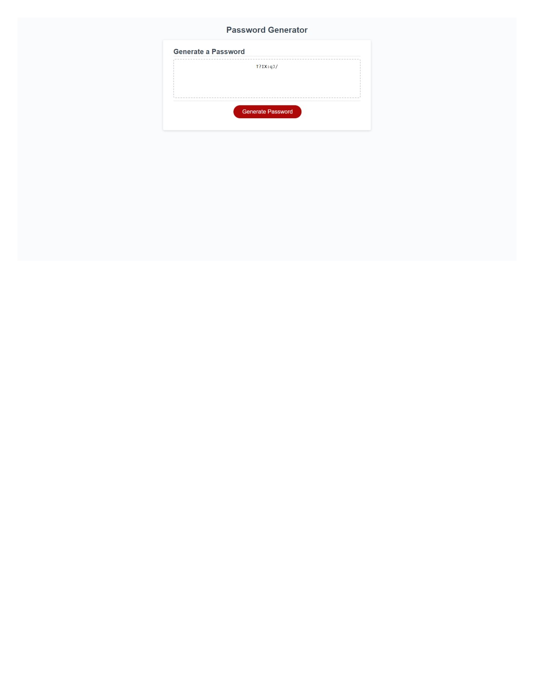

# Passwords-For-You
Sick of making your own zanny passwords to keep all of your sensitive information safe?
This is a random password generator is for you!

## Description

Exactly as stated, this tool is meant to assist users create unique passwords with ease. Users can have one less thing on their plate.

- For me personally, this projected further helped me understand coding with javascript and using a slew of resources available on the internet to help me understand the steps I needed to take to make this work. I struggled a bit but am so thankful for the web development community.
- For others, it'll save time thinking of intricate passwords, so kick back and relax. I know I hated having to think of a new password every other month so I hope others would enjoy this.
- The ultimate motivation is the end user. As cheesy as it sounds, the purpose of this code IS for you as much as it is for me to learn. We both get something out of  it.
- So far, for loops are my favorite and learning about the various ways code can achieve one thing.

## Use

Follow the link to the generator! Here's an example I made of a password. Simply answer the prompts for your VERY OWN unique password 😎 

- https://mrobles-dev.github.io/Passwords-For-you/

## Acknowledgement

A few links that could help you figure out your own generator as well as the reasons JS makes the code generator possible.

- https://www.geeksforgeeks.org/how-to-generate-a-random-password-using-javascript/
- https://stackoverflow.com/questions/63822962/i-am-making-a-password-generator-using-javascript-the-password-does-not-display
- https://www.geeksforgeeks.org/how-to-generate-random-number-in-given-range-using-javascript/?ref=lbp
- https://developer.mozilla.org/en-US/docs/Web/JavaScript/Reference/Operators/Addition_assignment
- https://dev.to/code_mystery/random-password-generator-using-javascript-6a
- OpenAI ChatGPT for help debugging 

Thank you all.

## License 
MIT License

Copyright (c) 2023 Milton Robles

Permission is hereby granted, free of charge, to any person obtaining a copy
of this software and associated documentation files (the "Software"), to deal
in the Software without restriction, including without limitation the rights
to use, copy, modify, merge, publish, distribute, sublicense, and/or sell
copies of the Software, and to permit persons to whom the Software is
furnished to do so, subject to the following conditions:

The above copyright notice and this permission notice shall be included in all
copies or substantial portions of the Software.

THE SOFTWARE IS PROVIDED "AS IS", WITHOUT WARRANTY OF ANY KIND, EXPRESS OR
IMPLIED, INCLUDING BUT NOT LIMITED TO THE WARRANTIES OF MERCHANTABILITY,
FITNESS FOR A PARTICULAR PURPOSE AND NONINFRINGEMENT. IN NO EVENT SHALL THE
AUTHORS OR COPYRIGHT HOLDERS BE LIABLE FOR ANY CLAIM, DAMAGES OR OTHER
LIABILITY, WHETHER IN AN ACTION OF CONTRACT, TORT OR OTHERWISE, ARISING FROM,
OUT OF OR IN CONNECTION WITH THE SOFTWARE OR THE USE OR OTHER DEALINGS IN THE
SOFTWARE.
